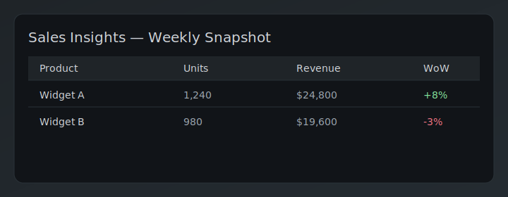
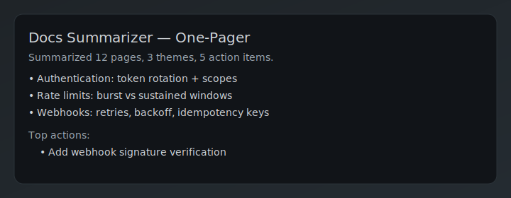
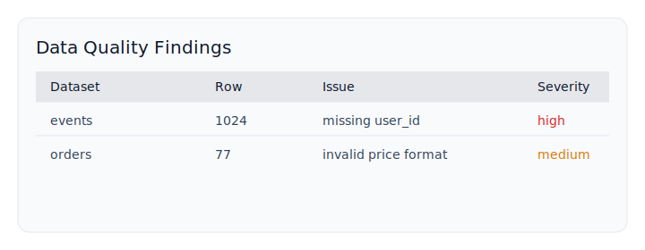

<h1 align="center">Super Codex Workbench 🚀</h1>
<h3 align="center">⚡A Supercharged Codex CLI Workspace, Batteries-Included🔋</h3>

  
  
  
  
  
  
  
  

<em>Made with ❤️ for friends by <strong>Sharper Flow LLC</strong></em>

---

## 🥳 Skip The Browser: Use Codex CLI
#### If you have ChatGPT Plus/Pro, Codex CLI turns chat into a local workstation that ships real outputs.

| Capability | Browser ChatGPT | Super Codex CLI |
|---|:--:|:--:|
| Run local commands and edit files | ❌ | ✅ |
| MCP integrations (web/docs/search, services) | ➖ limited | ✅ plug-and-play |
| Reproducible runs with logs and git checkpoints | ❌ | ✅ |
| Real artifacts (HTML/PDF/Excel/CSV/Parquet) in project folders | ❌ | ✅ |
| Quality gates (Ruff, Mypy), env health checks | ❌ | ✅ |
| Local-first privacy, offline option | ❌ | ✅ |
| Orchestrate multi-step flows across git, Docker, SQL, Make, shell | ❌ | ✅ |
| Data work at scale (Pandas, DuckDB) | ❌ | ✅ |

---
## 🤔 Who Is This For?

- 📊 Analysts, PMs, ops who are comfortable with tools not code.
- ⚡ Power users who want repeatable results without wiring everything manually.
- 🔨 Pros who want to work fast with the latest toolset, auto-updated.

## ⚡ Supercharge Codex CLI With All the Tools You Need.

- 🚣 Project-centric flow with tidy, repeatable workspaces.
- 🧷 Automatic git checkpoints for easy rollbacks.
- 🌐 Web + docs context via Firecrawl + Context7 when configured.
- 📝 Elegant reporting to HTML/PDF/Excel.
- 🪟 Windows-friendly with WSL2.

> Requires ChatGPT Plus/Pro — details in `AGENTS.md`.

Level up from chat-only answers to a local, executable workbench that ships real outputs.

---

## 👉 Ready to go? Get Started Now 🚀

> **Windows (first-time)**  
> Download `windows-setup.ps1` → open PowerShell as Administrator → run:  
> `./scripts/windows-setup.ps1 -ProvisionWSL -DefaultProfile Ubuntu`  
> Reboot if prompted, open Ubuntu (WSL), and work under `~/`.

1. **Get the code**
   - `git clone https://github.com/Sharper-Flow/super-codex-workbench.git`
   - or fork then `git clone https://github.com/<your-username>/super-codex-workbench.git`
   - `cd super-codex-workbench`

2. **Install Codex CLI**
   - Ensure ChatGPT Plus/Pro access
   - Follow the **official Codex CLI install guide** for your OS
   - Verify Codex launches and can open this repo

3. **Launch Codex CLI and Run Setup**
   - Open your terminal (or WSL2 Ubuntu on Windows)
   - Run: `codex`
   - In Codex, say: **“run the setup script”**

---

## 🔌 Add Capabilities (MCP)

- MCP are “plugins” that add web/docs/search and service integrations.
- Comes ready for Firecrawl + Context7; browse more at https://mcp.so/
- Prompts you can use:
  - `Find an MCP for <your need>`
  - `Install the <X> MCP server`

---

## Use Case Samples

- 📊 **Sales insights app** — Ingest weekly CSVs, run Python transforms, and generate an HTML+PDF dashboard with highlights.  
  

- 🧾 **Finance reconciler** — Combine bank exports with invoices, flag mismatches, and email a PDF summary automatically.  
  

- 🧠 **Docs summarizer** — Crawl product docs with MCP, extract key points, and publish a one-pager brief.  
  

- 🔍 **Data quality bot** — Validate new batches, raise issues with details, and export a fix-list for teams.  
  

---

## Real-Life Recipes 🎯

Concrete, runnable flows you can copy. Use these natural language prompts in Codex CLI.

### 🏠 Smart Home: Nightly Energy Snapshot
- Output: daily usage summary (CSV + HTML + optional PDF).
- Prompts:
  - “Create a project named `home-energy` and set it current.”
  - “Register a dataset `energy_readings` as CSV partitioned by `date` and `source`.”
  - “Write a sample batch to `energy_readings` for `date=2025-01-01`, `source=smartplug`.”
  - “Summarize total kWh by device from `ds_energy_readings` and save the CSV as `energy_summary` in the project.”
  - “Render an HTML report titled `Home Energy Snapshot`, then export it to PDF.”
- Next: swap the sample batch for your real smart-plug/API feed.

### 👩‍⚕️ Appointments: Weekly Summary
- Output: weekly roll-up per client (CSV + HTML + optional PDF).
- Prompts:
  - “Create a project called `appointments` and select it.”
  - “Register a dataset `client_sessions` as CSV partitioned by `week`.”
  - “Write a sample batch to `client_sessions` for `week=2025-W01`.”
  - “Summarize sessions and hours by client from `ds_client_sessions` and save as `weekly_summary` CSV.”
  - “Render an HTML report titled `Weekly Appointments Summary` and also export a PDF.”
- Next: add a custom template under the project’s `templates` folder.

### 🔁 Vendor Policy Update Brief (MCP)
- Output: concise brief of recent policy pages (HTML + optional PDF).
- Requires: Firecrawl MCP configured (`.env` with `FIRECRAWL_API_KEY`) and `mcp.config.json`.
- Prompts:
  - “Create a project named `policy-briefs` and select it.”
  - “Check MCP status and confirm Firecrawl is configured.”
  - “Crawl `https://example.com/policy` (limit 5) and generate an HTML report under the project.”
  - “If a PDF backend is available, also export the report to PDF.”
- Tip: “Blend Context7 results using the query: your keywords.”

---

## Project Directory

No coding required — peek under the hood anytime. Technical details in [`AGENTS.md`](AGENTS.md).

- `apps/` — app-specific logic (prefix dataset names to avoid collisions)
- `data/` — ad-hoc inputs and scratch during tasks
- `reports/` — user-facing outputs (HTML/PDF/Excel) and templates
- `warehouse/` — curated datasets managed by the Warehouse API
- `scripts/` — helper scripts for setup, checks, and git checkpoints
- `logs/` — structured logs for task runs

## 🧠 Smart Installs (via uv)

As you request features, needed deps are added locally.

- PDFs: `weasyprint` or `pdfkit`
- Excel: `openpyxl`
- Parquet: `pyarrow`
- Charts: `plotly`

---

## Contributing

- License: MIT — see `LICENSE`.
- Contributing: Issues and PRs welcome. Keep diffs minimal, avoid secrets, and follow `AGENTS.md`.

### Bonus Fun

**Windows Terminal Theme (CodexDarkGrey) + Nerd Font** is included in the Windows setup script.

