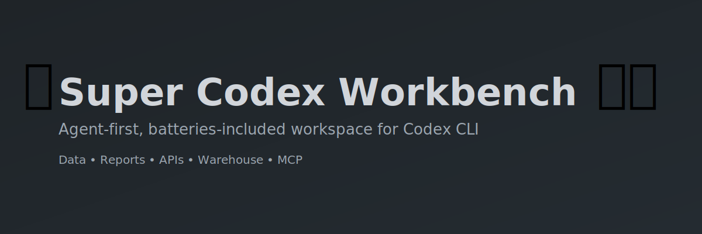
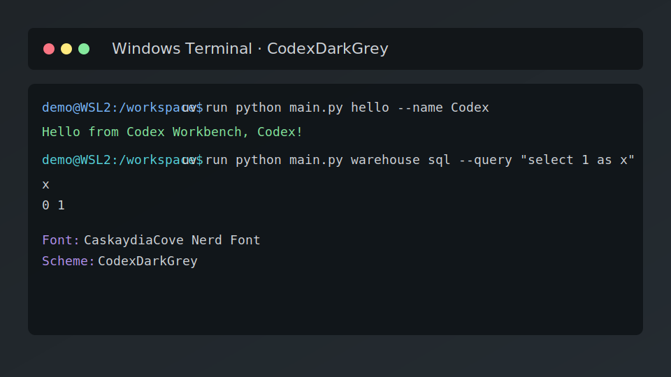
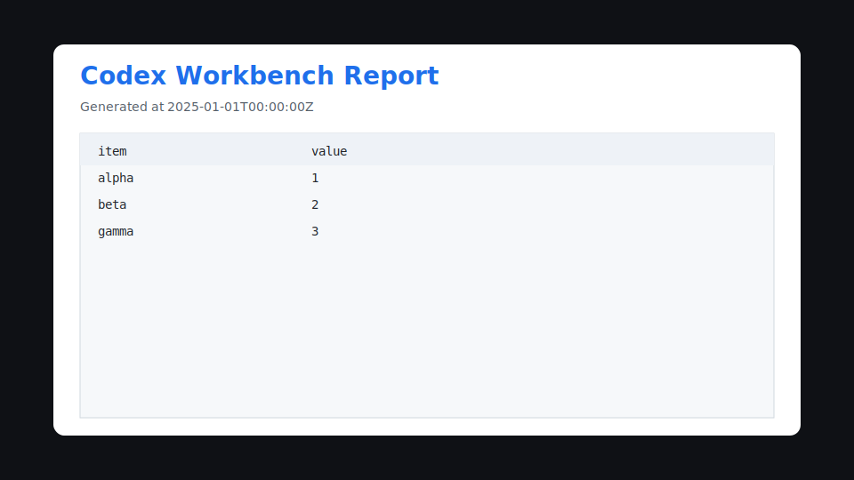

# Super Codex Workbench · Batteries‑Included for Codex CLI 🚀

<!-- Banner -->
<p align="center">
  
<br/>
  <a href="./LICENSE"></a>
  <a href="https://astral.sh/uv/"></a>
  <a href="https://github.com/astral-sh/ruff"></a>
  <a href="https://github.com/python/mypy"></a>
  <a href="https://pandas.pydata.org/"></a>
  <a href="https://duckdb.org/"></a>
  <a href="https://firecrawl.dev/"></a>
  <a href="https://context7.dev/"></a>
</p>

<p align="center"><em>Made with ❤️ for friends by <strong>Sharper Flow LLC</strong></em></p>

Turn ideas into data, reports, and APIs — fast. This repo is an agent‑first workbench for
Codex CLI: strict tooling, clean patterns, and ready‑made workflows with optional MCP context.

## Highlights
- ✅ Batteries‑included: uv deps, Ruff + Mypy, Pandas/DuckDB, Jinja2, HTML→PDF.
- 🗂️ Project‑aware: all outputs under `projects/<name>/...` with easy resume.
- 📦 Warehouse API: CSV/JSONL/Parquet with DuckDB SQL views (`ds_<dataset>`).
- 🌐 MCP‑ready: Firecrawl + Context7 helpers and a crawl→report workflow.
- 🧪 Friendly dev rig: logs, checks, and sample flows that “just work”.

## Quick Start (Users)
- Target audience: first‑time Codex CLI users. You won’t run Python commands — you will prompt Codex CLI and it will operate this repo for you.

### Windows (Recommended)
- 1) Prepare Windows + WSL2 (Admin PowerShell):
  ```powershell
  # From the repo folder on Windows
  powershell -ExecutionPolicy Bypass -File .\scripts\windows-setup.ps1 -ProvisionWSL -DefaultProfile Ubuntu
  ```
  - Installs Windows Terminal, Nerd Font, WSL2 + Ubuntu, and applies a clean theme.
  - If prompted to create a UNIX user in Ubuntu, complete that step.

- 2) Copy this repo into Ubuntu (WSL2):
  - Option A (Explorer): open `\\wsl$\Ubuntu\home\<your-username>\` and drag‑drop this repo folder (e.g., `codex`).
  - Option B (Git in Ubuntu): open an Ubuntu tab, then:
    ```bash
    cd ~ && git clone <your-repo-url> codex && cd codex
    ```

- 3) Install Codex CLI (in Ubuntu)
  - Follow Codex CLI’s official installation instructions, then verify `codex` runs in Ubuntu.
  - Open Ubuntu in Windows Terminal, `cd ~/codex`.

- 4) Launch Codex CLI from the repo
  - Start Codex CLI in this folder and interact using prompts (see “Try These Prompts”).

### Linux/macOS
- Ensure a modern terminal, Git, and Codex CLI are installed.
- Clone this repo locally and start Codex CLI in the repo folder, then use the prompts below.

## Try These Prompts
- Start here:
  - “Set this up for me and make a new ‘demo’ project. Show me where things will be saved.”
  - “Give me a quick health check and tell me if anything is missing.”

- Make a data table:
  - “I want a data table of baseball cards from 2007 Topps with player, team, and card number. Save it in my project.”
  - “Create a small sample table with 5 rows so I can see how results will look.”
  - “Clean up duplicates and sort the table by player name.”

- Summaries and exports:
  - “Show me a quick summary by team (counts and totals) and save it to my project.”
  - “Make a simple HTML report from that summary and also a PDF version.”
  - “Export the latest results to an Excel file in my project.”

- Web + research:
  - “Create a new automation that crawls websites for the best 3D models for office organization. Summarize the top 5 and link to the sources.”
  - “Crawl https://example.com and give me a short report of the key pages (limit 5).”
  - “Search the web for beginner guides on home espresso and include the top links in a report.”

- Projects:
  - “Resume my ‘demo’ project and show me the most recent outputs.”
  - “Create a fresh project called ‘baseball’ and put all new files under that project.”

## What The Agent Does
- Creates a local Python env with `uv` inside this repo when needed.
- Initializes project folders and selects a current project for outputs.
- Writes datasets into the warehouse and exposes DuckDB SQL views.
- Renders HTML and exports PDF/Excel into your project’s `reports/`.
- Uses MCP (if configured) to crawl the web or fetch context, then compiles a report.

## Troubleshooting
- ⚠️ Codex CLI not installed: follow its official install guide for Linux/macOS or run it inside Ubuntu (WSL2) on Windows.
- ⚠️ PDF export fails: ask Codex CLI to install a PDF backend (WeasyPrint or pdfkit + wkhtmltopdf) and re‑run the export step.
- ⚠️ MCP missing: add `FIRECRAWL_API_KEY` to `.env` (Context7 is optional), then ask Codex CLI to verify MCP.

## For Contributors
- Agent/coder instructions live in `AGENTS.md` (environment discipline, checks, MCP, and tooling). Keep user‑facing README prompt‑oriented.

## Showcase
- Windows Terminal theme (CodexDarkGrey) + Nerd Font

  

- Sample HTML report preview

  

## Reference
- More technical details live in `AGENTS.md`. If you’re contributing or operating as an agent/coder, start there.

## License
MIT — see `LICENSE`.
